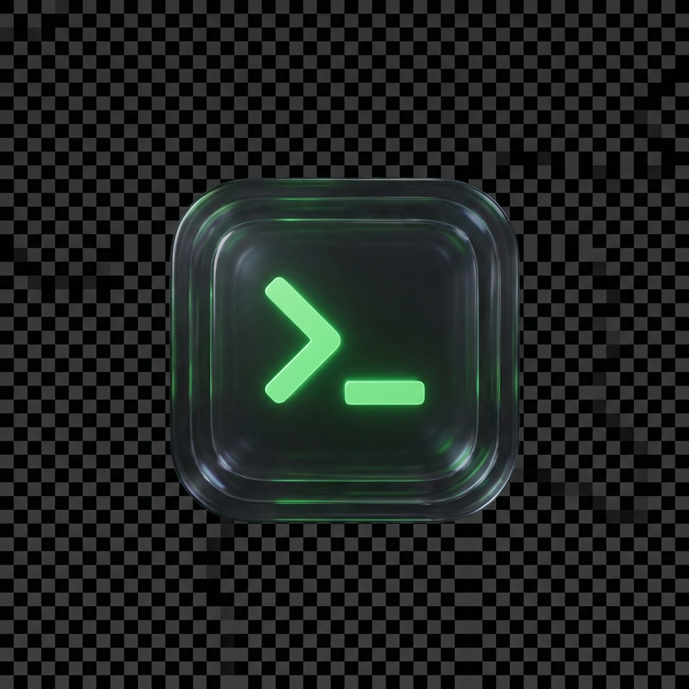

[](https://buymeacoffee.com/hs03)
[](https://smithery.ai/server/hs03/auto-terminal)

# Auto Terminal




**Auto Terminal** is a powerful process manager and terminal automation tool that doubles as a [Model Context Protocol (MCP)](https://modelcontextprotocol.io/) server. It allows AI agents (like Cursor, Claude Desktop) to execute terminal commands, manage background processes, and monitor output in real-time.

## Features

- **GUI & MCP Hybrid**: Runs as a standalone GUI application or a background MCP server.
- **Process Management**: Start, stop, and restart background processes easily.
- **Real-time Logs**: View live stdout/stderr logs for any running process.
- **Terminal Automation**: Execute arbitrary shell commands via MCP tools.
- **MacOS Optimized**: Native Dock icon support.

## Installation

```bash
git clone https://github.com/hoseoglee/auto-terminal.git
cd auto-terminal

# Create virtual environment
python3 -m venv .venv
source .venv/bin/activate

# Install dependencies
pip install -r requirements.txt
```

## Usage

### 1. GUI Mode
Run the application with a graphical interface to manage processes manually.

```bash
python gui_launcher.py
```

### 2. MCP Server Mode
This project uses `fastmcp` to expose tools to AI agents.

#### Arguments
- `--mcp`: Starts in MCP mode.
- `--sse`: Uses Server-Sent Events (SSE) transport (default on port 8000).

## MCP Configuration (for Cursor / Claude)

Add the following configuration to your `config.json` (Cursor) or `claude_desktop_config.json`.

**Option A: Run Directly (stdio)**
*Recommended for local usage.*
```json
{
  "mcpServers": {
    "auto-terminal": {
      "command": "/absolute/path/to/auto-terminal/.venv/bin/python",
      "args": [
        "/absolute/path/to/auto-terminal/gui_launcher.py",
        "--mcp"
      ]
    }
  }
}
```

**Option B: SSE Mode**
```json
{
  "mcpServers": {
    "auto-terminal": {
      "url": "http://localhost:8000/sse",
      "transport": "sse"
    }
  }
}
```

## Available Tools

The MCP server exposes the following tools to the AI:

- `list_programs()`: List configured and running processes.
- `start_program(name)`: Start a specific program.
- `stop_program(name)`: Stop a running program.
- `restart_program(name)`: Restart a program.
- `run_terminal_command(command, name, cwd)`: Execute any shell command.
- `get_program_logs(name, lines)`: Fetch recent logs.
- `send_program_input(name, input_text)`: Send stdin to a process.
- `add_program_config(name, command, cwd)`: Save a new program configuration.
- `remove_program_config(name)`: Remove a configuration.

## License

MIT License
